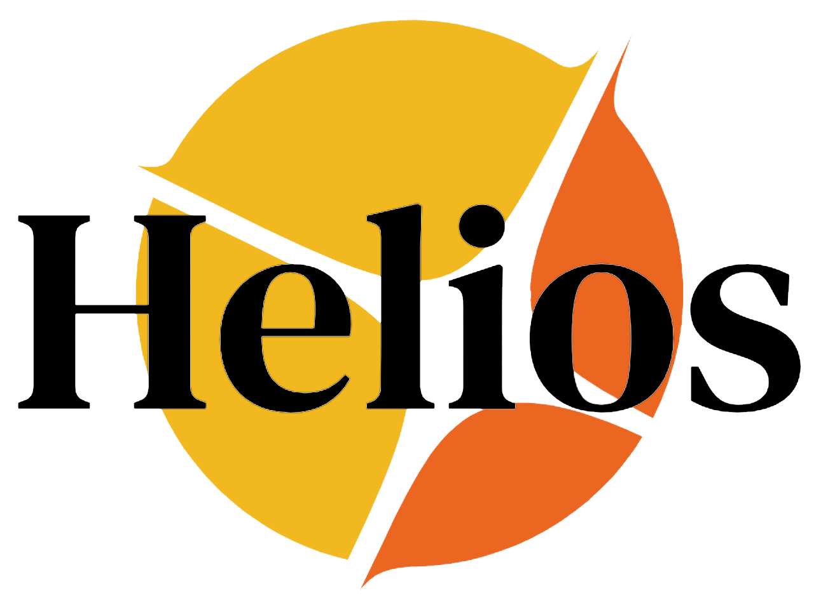
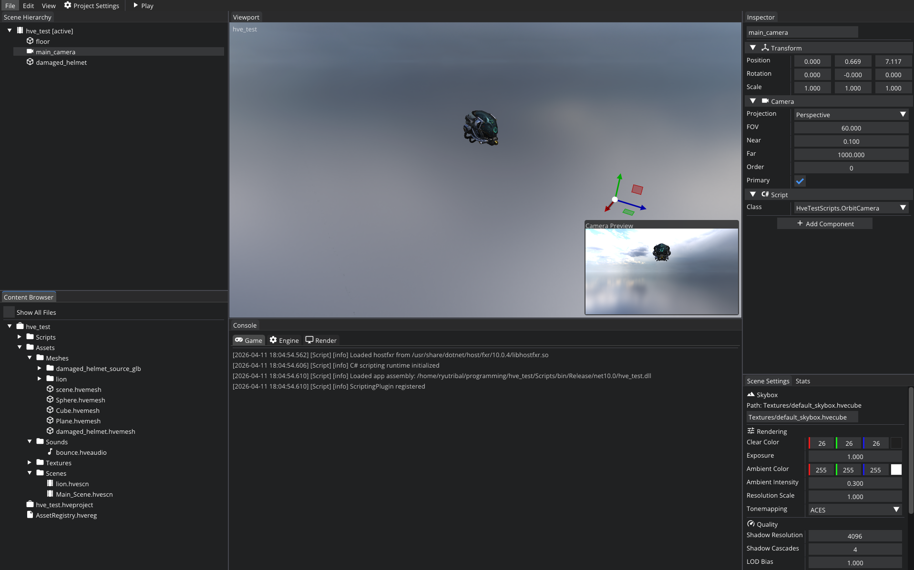
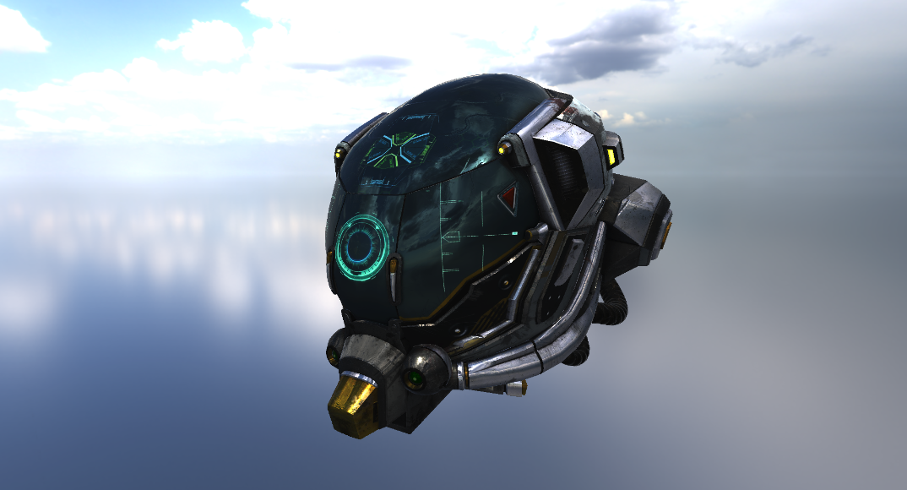
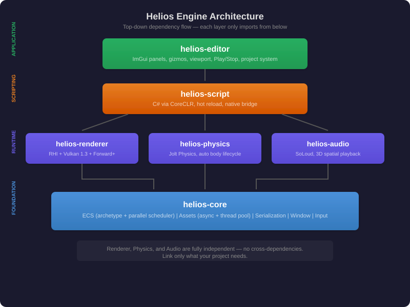

<h1 align="center">Helios Engine</h1>
<p align="center">
  
</p>

<p align="center">
  A modular, data-driven game engine built with C++20 and Vulkan 1.3.
</p>

<p align="center">
  <strong>v0.5.0</strong>
</p>

---

<p align="center">
  
</p>

<p align="center">
  
</p>

## Overview

Helios is a from-scratch game engine designed around a **top-down, modular architecture**. Every layer — from ECS to rendering to the editor — is a standalone library that can be used independently in your own C++ project.

**Key features:**
- **Custom ECS** with archetype storage, parallel scheduling, and Bevy-style runtime access gating
- **Vulkan 1.3** renderer with Forward+ pipeline, dynamic rendering, per-camera render targets
- **C# scripting** via .NET CoreCLR with hot-reload
- **Jolt Physics** integration with automatic body lifecycle management
- **SoLoud Audio** with spatial 3D playback
- **Scene system** with YAML serialization, sub-scenes, and Play/Stop snapshot restore
- **Editor** with ImGui docking, gizmos, viewport mouse picking, camera preview, content browser
- **Async asset pipeline** with shared thread pool, binary asset format (.hvemesh, .hvetex, .hveaudio)

## Architecture

<p align="center">
  
</p>

Each layer only depends on the layers below it. No upward imports. The core architecture — ECS with archetype storage, plugin-based app builder, system scheduling with runtime access gating — is heavily inspired by [Bevy](https://bevyengine.org/). Huge thanks to the Bevy community for proving that a data-driven, modular engine design works beautifully.

## Getting Started

### Requirements

- **C++20** compiler (GCC 12+, Clang 15+, MSVC 2022+)
- **CMake 3.24+**
- **Vulkan SDK** (1.3+)
- **.NET 10 SDK** (for C# scripting)
- **GLFW** (fetched automatically by CMake)

### Build

```bash
git clone git@github.com:RyuTribal/helios.git
cd helios
mkdir build && cd build
cmake .. -DCMAKE_BUILD_TYPE=Release
cmake --build . --target helios-editor
```

### Run the Editor

```bash
./build/bin/helios-editor /path/to/project.hveproject
```

### Run the Sandbox (standalone)

```bash
./build/bin/sandbox
```

## Project Structure

```
helios/
  CMakeLists.txt          Root build
  helios-core/            ECS, assets, serialization, window, input
  helios-renderer/        RHI, Vulkan backend, Forward+ pipeline
  helios-editor/          ImGui editor application
  helios-physics/         Jolt Physics integration
  helios-audio/           SoLoud audio integration
  helios-script/          C# scripting (CoreCLR)
  ScriptCore/             C# engine bridge assembly
  sandbox/                Standalone demo application
  tests/                  Unit tests (GTest)
```

## Using Helios as a Library

Every module is a static library. Link only what you need:

```cmake
# Minimal: just ECS + window + input
target_link_libraries(my_game PRIVATE helios-core)

# Add rendering
target_link_libraries(my_game PRIVATE helios-renderer)

# Add physics
target_link_libraries(my_game PRIVATE helios-physics)

# Add audio
target_link_libraries(my_game PRIVATE helios-audio)

# Add C# scripting
target_link_libraries(my_game PRIVATE helios-script)
```

### Minimal Example (headless ECS)

```cpp
#include <helios/ecs/app.h>
#include <helios/ecs/world.h>
#include <helios/components/components.h>

using namespace helios;

struct Velocity { float x, y, z; };

void move_system(Query<Transform, const Velocity> movers, Res<Time> time) {
    float dt = time->delta();
    for (auto [entity, t, v] : movers.with_entity()) {
        t.position.x += v.x * dt;
        t.position.y += v.y * dt;
        t.position.z += v.z * dt;
    }
}

int main() {
    App app;
    app.enable_parallel();
    app.add_system(Schedule::Update, move_system, "move");
    app.world().spawn(Transform{}, Velocity{1, 0, 0});
    app.run();
}
```

### With Rendering

```cpp
#include <helios/ecs/app.h>
#include <helios/window/window_plugin.h>
#include <helios/input/input_plugin.h>
#include <helios/render_plugin.h>
#include <helios/forward_plus/forward_plus_plugin.h>
#include <helios/assets/asset_plugin.h>

int main() {
    App app;
    app.enable_parallel();
    app.add_plugin(WindowPlugin{});
    app.add_plugin(InputPlugin{});
    app.add_plugin(RenderPlugin{});
    app.add_plugin(AssetPlugin{AssetPluginConfig{.asset_root = "assets"}});
    app.add_plugin(ForwardPlusPlugin{});

    // Spawn a camera
    app.world().spawn(
        Transform{.position = {0, 2, 8}},
        Camera{.fov_degrees = 60},
        ActiveCamera{}
    );

    app.run();
}
```

## Libraries

| Library | Purpose |
|---------|---------|
| [Vulkan](https://www.vulkan.org/) | GPU rendering (1.3, dynamic rendering) |
| [Jolt Physics](https://github.com/jrouwe/JoltPhysics) | Physics simulation |
| [SoLoud](https://github.com/jarikomppa/soloud) | Audio playback |
| [GLFW](https://github.com/glfw/glfw) | Window management |
| [GLM](https://github.com/g-truc/glm) | Linear algebra |
| [Dear ImGui](https://github.com/ocornut/imgui) | Editor UI |
| [ImGuizmo](https://github.com/CedricGuillemet/ImGuizmo) | 3D gizmos |
| [yaml-cpp](https://github.com/jbeder/yaml-cpp) | Scene serialization |
| [spdlog](https://github.com/gabime/spdlog) | Logging |
| [.NET CoreCLR](https://dotnet.microsoft.com/) | C# scripting runtime |
| [VMA](https://github.com/GPUOpen-LibrariesAndSDKs/VulkanMemoryAllocator) | GPU memory allocation |

## Coding Principles

These are enforced across the entire codebase:

1. **Top-down architecture** — Lower modules never import higher modules. Core doesn't know about the renderer. The renderer doesn't know about the editor.

2. **No raw backend types outside their layer** — Vulkan types stay in `helios-renderer/src/helios/vulkan/`. GLFW stays in `helios-core/src/helios/window/`. Everything above uses RHI abstractions.

3. **No exceptions** — Return-based error handling only. Factory functions return nullptr on failure. No throw/try/catch.

4. **RAII everywhere** — Resources exist at construction time. No lazy initialization, no scattered null checks. If a resource is needed, it must be created before the system runs.

5. **ECS-first** — All game state lives in the ECS. Systems are pure functions. Resources are world-scoped singletons. No global mutable state.

6. **Async by default** — Asset loading is non-blocking via the shared thread pool. Scripts, physics, and audio all integrate through the ECS event system.

7. **Don't reinvent** — Use existing infrastructure. `ThreadPool::submit()` for background work. `set_parent()`/`unparent()` for hierarchy. `resolve_mesh_paths()` for asset resolution. `AssetServer::load()` for caching.

## License

See [LICENSE](LICENSE) for details.
